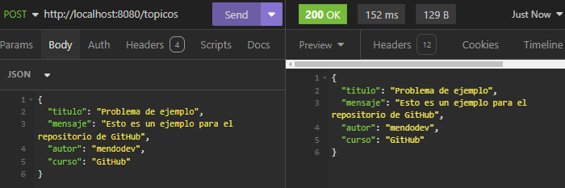
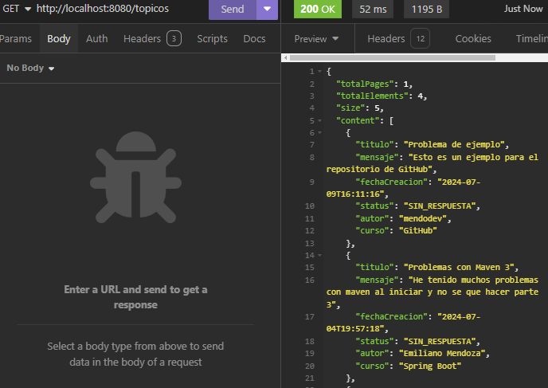
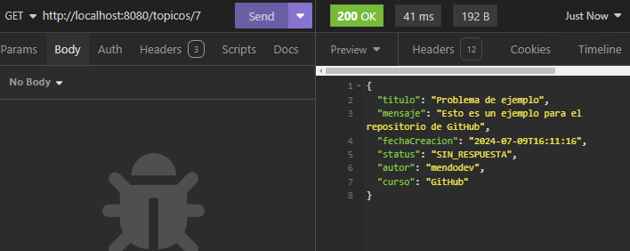
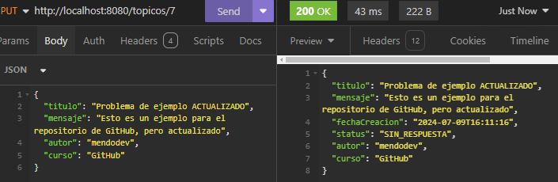
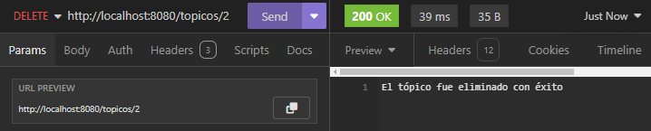
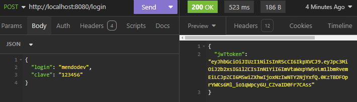

# Forohub API

API REST desarrollada con **Java 17 y Spring Boot** para la gestión de tópicos de un foro. El proyecto implementa operaciones CRUD, autenticación y autorización mediante **JWT y Spring Security**, persistencia de datos con **MySQL y Spring Data JPA**, migraciones con **Flyway** y documentación interactiva mediante **OpenAPI/Swagger**.

El proyecto fue desarrollado como parte de la formación **Oracle Next Education (ONE)**, con el objetivo de aplicar conocimientos de desarrollo backend, diseño de APIs REST, persistencia de datos y seguridad.


## Tecnologías

### Backend

* **Java 17**
* **Spring Boot**
* Spring Web
* Spring Data JPA
* Spring Security
* Spring Validation

### Base de datos

* **MySQL**
* **SQL**
* Flyway Migration

### Seguridad

* **JWT**
* Spring Security
* Java JWT

### Documentación y herramientas

* **SpringDoc OpenAPI / Swagger**
* Maven
* Lombok
* Git / GitHub
* Insomnia

### Pruebas

* Spring Boot Test
* Spring Security Test


## ¿Qué demuestra este proyecto?

Este proyecto permitió aplicar de manera práctica conocimientos relacionados con el desarrollo de aplicaciones backend:

* Diseño y desarrollo de **APIs REST**.
* Manejo de **peticiones HTTP y respuestas JSON**.
* Implementación de operaciones **CRUD**.
* Autenticación y autorización mediante **JWT y Spring Security**.
* Persistencia de información mediante **SQL, MySQL y Spring Data JPA**.
* Migraciones de base de datos utilizando **Flyway**.
* Validación de datos recibidos mediante la API.
* Organización del código mediante separación de responsabilidades.
* Documentación y exploración de endpoints mediante **OpenAPI/Swagger**.
* Gestión de dependencias y ejecución del proyecto mediante **Maven**.
* Control de versiones utilizando **Git y GitHub**.


## Características principales

### Autenticación y autorización

La API cuenta con un sistema de autenticación basado en **JWT** y **Spring Security**.

El usuario puede iniciar sesión para obtener un token que posteriormente puede utilizarse para acceder a los endpoints protegidos.

### Gestión de tópicos

La aplicación permite realizar las principales operaciones sobre los tópicos del foro:

* Crear tópicos.
* Consultar tópicos.
* Consultar un tópico específico.
* Actualizar tópicos.
* Eliminar tópicos.

### Persistencia de datos

La información es almacenada en una base de datos **MySQL** utilizando **Spring Data JPA**.

Las modificaciones y creación de estructuras de la base de datos son administradas mediante **Flyway Migration**.

### Documentación de la API

La API cuenta con documentación interactiva mediante **SpringDoc OpenAPI**, permitiendo consultar los endpoints disponibles y realizar solicitudes directamente desde Swagger UI.


## Arquitectura

El proyecto sigue una estructura organizada por responsabilidades, separando los componentes principales de la aplicación.

```text
Cliente
   │
   │ HTTP / JSON
   ▼
Controller
   │
   ▼
Domain / Business Logic
   │
   ▼
Repository
   │
   ▼
MySQL
```

La seguridad se integra mediante Spring Security y JWT para proteger los recursos que requieren autenticación.

```text
Cliente
   │
   │ Credenciales
   ▼
Login
   │
   ▼
JWT
   │
   │ Authorization: Bearer <token>
   ▼
Spring Security
   │
   ▼
Endpoint protegido
```

Esta separación permite mantener responsabilidades independientes y facilita el mantenimiento y evolución del proyecto.

---

## Principales endpoints

La API proporciona endpoints para autenticación y gestión de tópicos.

| Método   | Endpoint        | Descripción                                |
| -------- | --------------- | ------------------------------------------ |
| `POST`   | `/login`        | Autentica un usuario y genera un token JWT |
| `POST`   | `/topicos`      | Crea un nuevo tópico                       |
| `GET`    | `/topicos`      | Obtiene los tópicos registrados            |
| `GET`    | `/topicos/{id}` | Obtiene un tópico específico               |
| `PUT`    | `/topicos/{id}` | Actualiza un tópico                        |
| `DELETE` | `/topicos/{id}` | Elimina un tópico                          |

> Los endpoints que requieren autenticación deben recibir el token JWT correspondiente.


## Demostración

### Documentación con Swagger / OpenAPI

La API puede explorarse y probarse mediante Swagger UI.

Desde esta interfaz es posible:

* Consultar los endpoints disponibles.
* Revisar parámetros y respuestas.
* Autenticarse.
* Enviar solicitudes HTTP.
* Probar los diferentes recursos de la API.

### Pruebas con Insomnia

Durante el desarrollo se realizaron pruebas de los diferentes endpoints utilizando Insomnia, incluyendo:

* Inicio de sesión.
* Obtención del token JWT.
* Creación de tópicos.
* Consulta de tópicos.
* Consulta individual por ID.
* Actualización de tópicos.
* Eliminación de tópicos.

## Crear un tópico


## Obtener tópico


## Obtener tópico por ID


## Actualizar tópico


## Eliminar tópico


## Inicio de sesión


## Instalación y ejecución

### Requisitos

Antes de ejecutar el proyecto necesitas tener instalado:

* **Java 17 o superior**
* **MySQL**
* Git

No es necesario instalar Maven por separado, ya que el proyecto incluye el **Maven Wrapper**.

### 1. Clonar el repositorio

```bash
git clone https://github.com/mendodevv/desafio-forohub.git
cd desafio-forohub
```

### 2. Configurar MySQL

Crea una base de datos en MySQL y configura las credenciales necesarias para la aplicación.

En el archivo:

```text
src/main/resources/application.properties
```

configura los valores correspondientes a tu entorno.

Por ejemplo:

```properties
spring.datasource.url=jdbc:mysql://localhost:3306/tu_base_de_datos
spring.datasource.username=tu_usuario
spring.datasource.password=tu_contraseña
```

También debes configurar una clave para la generación de tokens JWT:

```properties
api.security.secret=${JWT_SECRET}
```

> No se recomienda subir credenciales, contraseñas o claves secretas al repositorio. Para entornos reales, utiliza variables de entorno.

### 3. Ejecutar la aplicación

En Windows:

```bash
mvnw.cmd spring-boot:run
```

En Linux/macOS:

```bash
./mvnw spring-boot:run
```

Al iniciar la aplicación, las migraciones configuradas mediante **Flyway** serán ejecutadas automáticamente.

---

## Acceder a Swagger

Una vez iniciada la aplicación, abre:

```text
http://localhost:8080/swagger-ui.html
```

Desde Swagger UI puedes explorar y probar los endpoints disponibles utilizando el botón **Try it out**.

---

## Estructura del proyecto

La estructura principal del código se encuentra organizada de la siguiente manera:

```text
src/
└── main/
    ├── java/
    │   └── com/aluracursos/forohub/
    │       ├── controller/
    │       ├── dominio/
    │       └── infra/
    │           └── security/
    │
    └── resources/
        ├── db/
        │   └── migration/
        └── application.properties
```

### Principales responsabilidades

**`controller`**

Contiene los controladores encargados de recibir y procesar las solicitudes HTTP.

**`dominio`**

Contiene las entidades, DTOs y componentes relacionados con la lógica y persistencia de los recursos principales de la aplicación.

**`infra/security`**

Contiene la configuración relacionada con seguridad, autenticación, autorización y JWT.

**`db/migration`**

Contiene las migraciones utilizadas por Flyway para administrar la estructura de la base de datos.


## Estado del proyecto

**Finalizado.**

El proyecto cumple con las funcionalidades principales planteadas para el desafío y cuenta con autenticación, operaciones CRUD, persistencia de datos y documentación de la API.


## Licencia

Este proyecto está disponible bajo la licencia **MIT**.


## Autor

**mendodevv**

[GitHub](https://github.com/mendodevv)


