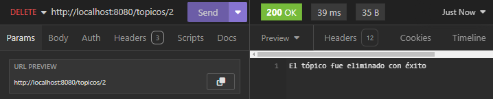

# Desafío Forohub

Este proyecto, llamado "Desafío Forohub", fue realizado como parte de la formación en el programa Oracle Next Education (ONE). Es una API rest que nos permite crear, leer, actualizar y eliminar tópicos (Se aplican las operaciones CRUD). Tiene un sistema de autenticación que implementa las tecnologías de Spring Security y tokens JWT.

## Descripción del proyecto
Este proyecto utiliza Java y Spring Boot como tecnologías principales, con Maven para la gestión de dependencias. La arquitectura del proyecto sigue las mejores prácticas y patrones de diseño, organizándose en paquetes específicos para modelos, repositorios, servicios y configuraciones de seguridad.

Se implementa autenticación JWT para proteger las rutas y asegurar que solo los usuarios autorizados puedan acceder a ciertas funcionalidades. Además, se integra con Spring Security para una gestión de seguridad robusta y flexible.

La documentación de la API se realiza mediante SpringDoc, que proporciona una interfaz de usuario de Swagger para explorar y probar los endpoints de la API de manera interactiva.

## Características principales

- **Autenticación y Autorización:** Implementación de JWT y Spring Security para gestionar el acceso.
- **CRUD de Tópicos:** Usuarios pueden crear, leer, actualizar y eliminar tópicos de discusión.
- **Documentación de API:** Integración con SpringDoc para documentación automática y exploración de la API.

## Organización del código
El proyecto sigue la estructura estándar de Maven y se organiza en varios paquetes:

- `com.aluracursos.forohub.controller`: Controladores para manejar las solicitudes HTTP.
- `com.aluracursos.forohub.dominio`: Contiene a nuestros objetos (Topico y usuario) y todo lo que se relacione con ellos, por ejemplo en el caso del tópico, su clase, repositorio, DTOS, etc...
- `com.aluracursos.forohub.infra.security`: Configuraciones de seguridad, autenticación, manejo de errores y configuración de springdoc.

Asimismo, contamos con:

- Las dependencias necesarias:
  - Lombok
  - Spring Web
  - Spring Boot DevTools
  - Spring Data JPA
  - Flyway Migration
  - MySQL Driver
  - Validation
  - Spring Security
  - Java JWT
  - Springdoc

 - La declaración y configuración de la base de datos en el archivo `application.properties`

## Organización del código de manera gráfica

## Demostración de la aplicación
### Demostración con Insomnia
<table>
  <tr>
    <td>
      
Crear un tópico

      
    </td>
    <td>
      
Obtener la lista de todos los tópicos

      
    </td>
  </tr>
  <tr>
    <td>
      
Obtener un tópico individual por id

      
    </td>
    <td>
      
Actualizar un tópico ya creado por id

      
    </td>
  </tr>
  <tr>
    <td>
      
Eliminar un tópico por id

      
    </td>
    <td>
      
Inicio de sesión para obtener un token y usar los endpoints

      
    </td>
</table>

## Como usar la aplicación
**Clonar el repositorio**

Para empezar, necesitas clonar el repositorio en tu máquina local. Puedes hacerlo utilizando el siguiente comando en tu terminal:
   `git clone https://github.com/mendodevv/desafio-forohub.git`
   
O si lo prefieres, puedes presionar el botón verde `code<>` del repositorio y descargar los archivos como ZIP

1. Configurar la base de datos

La aplicación utiliza una base de datos MySQL. Deberás crear una base de datos local y configurar las credenciales de la base de datos en el archivo src/main/java/resources/application.properties. Reemplaza ${DATASOURCE_USERNAME}, ${DB_PASSWORD} y ${JWT_SECRET:123456} con tus propios valores (Puede ser en el mismo archivo properties, o creando tus propias variables de entorno).
- DB_NAME_LITERALURA: el nombre de tu base de datos.
- DATASOURCE_USERNAME: el nombre del usuario de la base datos.
- DB_PASSWORD: la contraseña que pusiste para MySQL.
En el `spring.datasource.url` debes colocar la url de tu base de datos. Lo de hasta el final es el nombre, el cuál deberás reemplazar por el nombre que le hayas puesto a la tuya.

2. Ejecutar e interactuar con la la API

Al ejecutar la API, las migraciones den la carpeta de recursos se aplicarán, y una vez iniciado todo, podrás hacer uso de la api a través de una aplicación como lo es Insomnia (Ejemplo de su uso mencionado en este mismo readme), o también hacer uso de la documentación y Swagger.

## Cómo utilizar la documentación de la API
Para acceder a la documentación de la API y probar los endpoints disponibles, sigue estos pasos:

1. Inicia la aplicación.
2. Navega a `http://localhost:8080/swagger-ui.html` en tu navegador.
3. Explora los diferentes endpoints disponibles, sus parámetros y respuestas.
4. Utiliza el botón "Try it out" para realizar solicitudes de prueba directamente desde la interfaz de Swagger.

## Tecnologías utilizadas
- **Java SE17**
- **Spring Boot**
- **Maven**
- **SQL y MySQL**
- **Spring Data JPA**
- **Spring Security**
- **Spring Validation**
- **Spring Web**
- **Flyway**
- **Lombok**
- **Spring Boot DevTools**
- **Spring Boot Test**
- **Spring Security Test**
- **Java JWT**
- **SpringDoc OpenAPI**

## Estado del proyecto

Finalizado.

## Licensias

MIT License.

